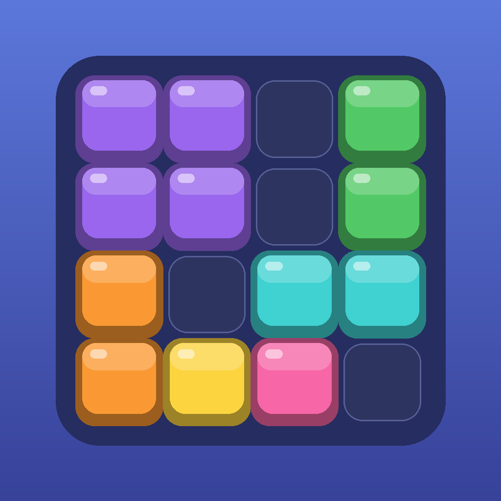

# Block Grid

A small, colourful block-puzzle game for iPhone, built for one purpose: to be a
version of the classic 8×8 block-drop puzzle that a kid can play with **no ads,
no pop-ups, no in-app purchases, no accounts and no internet connection**.

<p align="center">
  
</p>

## How to play

- Three pieces sit in the tray under the board. Drag one onto the 8×8 grid.
- Pieces cannot be rotated — place them as they come.
- Fill a full row or a full column and it clears, freeing up space.
- Clear more than one line at once, or clear on consecutive moves, for bonus points.
- When none of the three pieces fits anywhere, the game ends. Tap **Play Again**.

The game auto-saves, so closing the app mid-game and coming back later resumes
exactly where you were.

## Settings

The ⚙︎ button in the top-right corner opens the only menu in the app:

- **Sound** on/off
- **Vibration** on/off
- **New Game**
- **Reset Best Score** (requires a second confirming tap)

## Privacy

There is nothing to disclose, which is the point:

- No network code at all — no `URLSession`, no web views, no sockets.
- No analytics, no crash reporting, no ad SDKs, no third-party dependencies.
- No permissions requested (no camera, mic, location, contacts, tracking).
- The only stored data is the best score and the two toggles, kept locally in
  `UserDefaults`. Deleting the app deletes them.

## Install it on your iPhone

See **[docs/INSTALL_ON_IPHONE.md](docs/INSTALL_ON_IPHONE.md)** — a step-by-step guide
for side-loading with a free Apple ID, no App Store involved.

## Building and testing

Requirements: macOS with Xcode 16+ (built and tested against Xcode 26.2 / iOS 26.2 SDK).
Deployment target is iOS 17.0, iPhone only, portrait only.

```bash
open BlockGridKids.xcodeproj                       # then press ⌘R

# or from the command line:
xcodebuild build -project BlockGridKids.xcodeproj -scheme BlockGridKids \
  -destination 'platform=iOS Simulator,name=iPhone 17' CODE_SIGNING_ALLOWED=NO

xcodebuild test -project BlockGridKids.xcodeproj -scheme BlockGridKids \
  -destination 'platform=iOS Simulator,name=iPhone 17'
```

## Project layout

```
BlockGridKids/
  Model/       Pure Swift game rules (Foundation only, no UIKit) — fully unit-tested
               Board, ShapeTemplate/ShapeLibrary, ShapeGenerator, ScoringEngine, GameEngine
  Scene/       All rendering and UI, built entirely from SpriteKit nodes
               GameScene (layout + input), BoardNode, PieceNode, HUDNode, panels, effects
  Support/     Theme, persistence, haptics, procedural sound, safe-area helpers
  App/         SwiftUI entry point — a thin full-screen SpriteView host
BlockGridKidsTests/   XCTest suite for the model layer
Config/Info.plist     Launch-screen colour (merged with the generated Info.plist)
Tools/generate_icon.py  Regenerates the 1024×1024 app icon
docs/                 Implementation plan and the iPhone install guide
```

Two deliberate architecture choices:

1. **All UI is SpriteKit**, including buttons and panels, so there is one
   coordinate system and one layout pass — no SwiftUI/SpriteKit alignment drift.
2. **No audio assets ship with the app.** `ToneSynthesizer` builds 16-bit PCM WAV
   data in memory at runtime and hands it to `AVAudioPlayer`. The session uses
   the `.ambient` category so the game respects the ring switch and never
   interrupts music the phone is already playing.

## Regenerating the app icon

```bash
python3 Tools/generate_icon.py
```

Writes `BlockGridKids/Assets.xcassets/AppIcon.appiconset/AppIcon-1024.png`
(requires Pillow).

## Notes on originality

This is a clean-room implementation of a generic block-drop puzzle — a genre
that goes back decades. No code, artwork, sounds, fonts, names or branding from
any commercial game were used or copied. It is not published anywhere and is
intended solely for personal, private installation.
